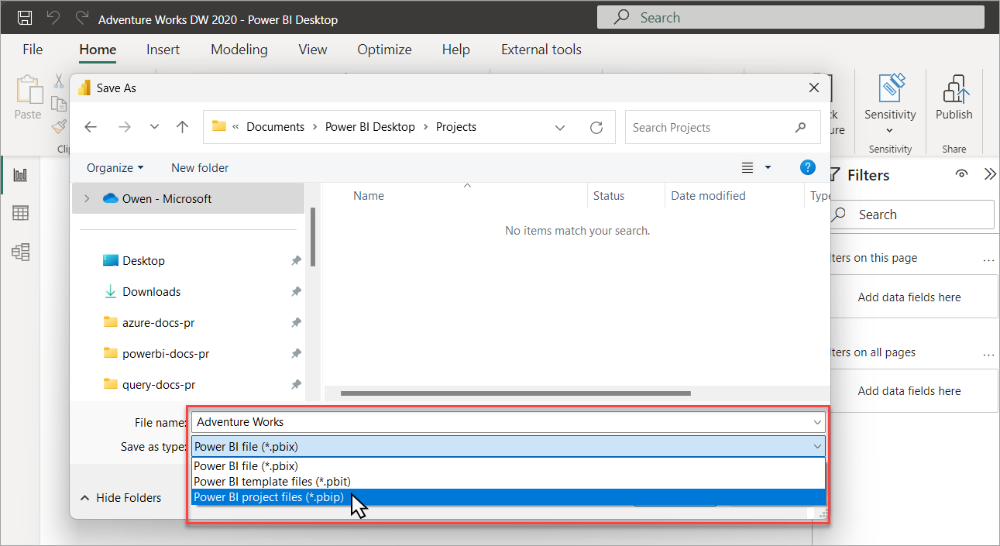

# Power BI to Databricks AI/BI Dashboard Converter

Convert Power BI reports (.pbip) into Databricks AI/BI dashboards (.lvdash.json) using AI-assisted coding with the [Databricks AI Dev Kit](https://github.com/databricks-solutions/ai-dev-kit/tree/main).

This repository provides a structured workflow, conversion instructions, and a working example that AI coding assistants (Cursor, Claude Code, Windsurf, etc.) can follow to translate your Power BI dashboards into native Databricks AI/BI dashboards.

---

## Before & After

**Power BI Desktop**


**Databricks AI/BI Dashboard**


---

## How It Works

```
┌───────────────────────┐       ┌───────────────────────────┐       ┌──────────────────────────┐
│   Power BI Desktop    │       │   AI Coding Assistant     │       │   Databricks Workspace   │
│                       │       │   (Cursor / Claude Code)  │       │                          │
│  Save as .pbip ───────┼──────>│                           │       │                          │
│                       │       │  1. Read .pbip structure  │       │                          │
│  Report visuals       │       │  2. Parse semantic model  │       │                          │
│  Semantic model       │       │  3. Map visuals to widgets│       │                          │
│  Relationships        │       │  4. Generate SQL datasets │──────>│  Test queries via SQL    │
│                       │       │  5. Build .lvdash.json    │       │  warehouse               │
│                       │       │  6. Deploy dashboard      │──────>│  Publish AI/BI dashboard │
└───────────────────────┘       └───────────────────────────┘       └──────────────────────────┘
```

---

## Prerequisites

- **Power BI Desktop** (to export your report as `.pbip`)
- **Databricks workspace** with a SQL warehouse and Unity Catalog tables
- **AI coding assistant** with MCP support: [Cursor](https://cursor.com), [Claude Code](https://docs.anthropic.com/en/docs/agents-and-tools/claude-code/overview), or [Windsurf](https://windsurf.com)
- **Python 3.11+** (for the AI Dev Kit MCP server)

---

## Quick Start

### 1. Install the Databricks AI Dev Kit

The [AI Dev Kit](https://github.com/databricks-solutions/ai-dev-kit/tree/main) provides MCP tools that let your coding assistant execute SQL, manage dashboards, and interact with your Databricks workspace directly.

Run the installer from the AI Dev Kit repository:

```bash
# macOS / Linux
curl -fsSL https://raw.githubusercontent.com/databricks-solutions/ai-dev-kit/main/install.sh | bash
```

```powershell
# Windows (PowerShell)
irm https://raw.githubusercontent.com/databricks-solutions/ai-dev-kit/main/install.ps1 | iex
```

This will:
- Clone the AI Dev Kit repository
- Set up the Databricks MCP server
- Install skills for Databricks development (dashboards, pipelines, SDK, etc.)
- Configure your coding assistant (Cursor, Claude Code, or Windsurf)

After installation, verify you see a `.cursor/mcp.json` (or equivalent config for your assistant) that points to the Databricks MCP server.

### 2. Set Up Your Conversion Project

Replicate the structure of this repository for your own dashboards:

```
my-pbi-converter/
├── .cursor/
│   ├── mcp.json                    # AI Dev Kit MCP server config (auto-created by installer)
│   └── skills/                     # AI Dev Kit skills (auto-created by installer)
├── figures/                        # Screenshots for documentation
├── pbi-to-aibi-converter/
│   ├── input/                      # Place your .pbip reports here
│   │   └── YourReport.pbip
│   │   └── YourReport.Report/
│   │   └── YourReport.SemanticModel/
│   ├── output/                     # Converted .lvdash.json files go here
│   └── CONVERSION_GUIDE.md         # Conversion instructions for the AI assistant
├── relevant_docs.md                # Reference links
└── README.md
```

Create the folders:

```bash
mkdir -p pbi-to-aibi-converter/input
mkdir -p pbi-to-aibi-converter/output
mkdir -p figures
```

Copy the `CONVERSION_GUIDE.md` from this repository into your `pbi-to-aibi-converter/` folder. This file contains the detailed mapping rules that the AI assistant will follow.

### 3. Export Your Power BI Report as .pbip

Open your report in Power BI Desktop and save it as a **Power BI Project file (.pbip)**:

1. Go to **File > Save As**
2. In the "Save as type" dropdown, select **Power BI project files (\*.pbip)**
3. Save to your `pbi-to-aibi-converter/input/` folder



This creates a folder structure with human-readable JSON and TMDL files that describe your report's visuals, data model, and relationships -- which is what the AI assistant will parse.

> **Note:** The `.pbip` format is Power BI's source-control-friendly project format. Unlike `.pbix` (binary), `.pbip` files can be read and understood by AI coding assistants. See the [Power BI Projects documentation](https://learn.microsoft.com/en-us/power-bi/developer/projects/projects-overview) for more details.

### 4. Ask Your AI Assistant to Convert It

Open the project in your coding assistant and ask it to convert the dashboard. The assistant will use the AI Dev Kit's MCP tools to read the PBI structure, test SQL queries against your warehouse, and generate the AI/BI dashboard.

**Example prompts:**

> Convert the Power BI dashboard from `pbi-to-aibi-converter/input/` to a Databricks AI/BI dashboard. Follow the conversion instructions in `pbi-to-aibi-converter/CONVERSION_GUIDE.md`. Save the output as a `.lvdash.json` file in `pbi-to-aibi-converter/output/`.

or more specifically:

> Read the .pbip report in `pbi-to-aibi-converter/input/MyReport.Report/` and its semantic model in `pbi-to-aibi-converter/input/MyReport.SemanticModel/`. Map every visual, slicer, and card to the equivalent AI/BI widget type using the CONVERSION_GUIDE.md instructions. Test all SQL queries against my Databricks workspace before creating the .lvdash.json file.

**What the assistant will do:**
1. Parse the `.tmdl` table files to find source tables (`catalog.schema.table`)
2. Read `relationships.tmdl` to understand JOINs
3. Read each `visual.json` to identify chart types, measures, and dimensions
4. Design SQL datasets that flatten the PBI star schema into query-ready tables
5. Test every query via the `execute_sql` MCP tool against your warehouse
6. Build the `.lvdash.json` following AI/BI dashboard spec rules
7. Deploy and publish the dashboard to your workspace

### 5. Publish the Dashboard

After conversion, the AI assistant can deploy the dashboard directly using the MCP tools. If you prefer to publish manually, you have two options:

**Option A: Let the assistant deploy it (recommended)**

The assistant uses `create_or_update_dashboard` and `publish_dashboard` MCP tools to deploy directly to your workspace. Just ask:

> Deploy the .lvdash.json file from `pbi-to-aibi-converter/output/` to my Databricks workspace and publish it.

**Option B: Deploy via Databricks CLI**

```bash
# Import the dashboard JSON to your workspace
databricks workspace import \
  pbi-to-aibi-converter/output/YourDashboard.lvdash.json \
  /Workspace/Users/your-email@company.com/YourDashboard.lvdash.json \
  --format AUTO --overwrite

# Then open it in the Databricks UI and click "Publish"
```

**Option C: Deploy via Databricks Asset Bundles (DABs)**

For production deployments with CI/CD, add the dashboard to a DAB configuration:

```yaml
# databricks.yml
resources:
  dashboards:
    my_dashboard:
      display_name: "My Converted Dashboard"
      file_path: ../pbi-to-aibi-converter/output/YourDashboard.lvdash.json
      warehouse_id: ${var.warehouse_id}
```

```bash
databricks bundle deploy
```

---

## Included Example

This repository includes a complete working example:

| File | Description |
|------|-------------|
| `pbi-to-aibi-converter/input/BakehouseReport.pbip` | Original Power BI report (Bakehouse franchise sales) |
| `pbi-to-aibi-converter/input/BakehouseReport.Report/` | PBI report definition (visuals, pages, themes) |
| `pbi-to-aibi-converter/input/BakehouseReport.SemanticModel/` | PBI semantic model (tables, relationships, columns) |
| `pbi-to-aibi-converter/output/BakehouseSalesHighlights.lvdash.json` | Converted AI/BI dashboard |
| `pbi-to-aibi-converter/CONVERSION_GUIDE.md` | Detailed conversion instructions |

The example converts a Bakehouse Sales dashboard with:
- 2 KPI cards (Customers, Transactions) + 1 added (Revenue)
- 1 donut chart (Sales by Product) -> pie chart
- 1 pivot table (Transactions by Franchise) -> bar chart
- 1 line chart (Sales Over Time)
- 4 slicers (Country, City, District, Date) -> global filters

Data source: `samples.bakehouse` (available on all Databricks workspaces).

---

## Conversion Guide Summary

The full guide is in [`pbi-to-aibi-converter/CONVERSION_GUIDE.md`](pbi-to-aibi-converter/CONVERSION_GUIDE.md). Key mappings:

### Visual Type Mapping

| Power BI Visual | AI/BI Widget | Version |
|-----------------|-------------|---------|
| `textbox` | Text (multilineTextboxSpec) | N/A |
| `card` | `counter` | 2 |
| `slicer` (dropdown) | `filter-multi-select` | 2 |
| `slicer` (date range) | `filter-date-range-picker` | 2 |
| `lineChart` | `line` | 3 |
| `barChart` | `bar` | 3 |
| `donutChart` / `pieChart` | `pie` | 3 |
| `pivotTable` / `table` | `table` | 2 |
| `shape` | (skip -- decorative) | - |

### Aggregation Mapping

| PBI DAX Function | SQL Equivalent |
|------------------|---------------|
| SUM(column) | `SUM(\`column\`)` |
| AVERAGE(column) | `AVG(\`column\`)` |
| COUNT(column) | `COUNT(\`column\`)` |
| DISTINCTCOUNT(column) | `COUNT(DISTINCT \`column\`)` |
| MIN(column) / MAX(column) | `MIN(\`column\`)` / `MAX(\`column\`)` |

### Key Differences

| Concept | Power BI | Databricks AI/BI |
|---------|----------|------------------|
| Data model | Star schema with relationships | Flat SQL datasets with JOINs |
| Measures | DAX expressions | SQL aggregations in widget fields |
| Filters | Slicers on canvas | Filter widgets on global or page-level filter pages |
| Layout | Pixel coordinates (1280x720) | 6-column grid system |
| Deployment | Publish to Power BI Service | Deploy `.lvdash.json` to workspace |

---

## Relevant Documentation

- [Power BI Projects (.pbip) Overview](https://learn.microsoft.com/en-us/power-bi/developer/projects/projects-overview) -- Understanding the `.pbip` file format
- [How Hard Is It to Migrate a Power BI Dashboard?](https://blog.cauchy.io/p/how-hard-is-it-to-migrate-a-power?r=6r7jvu) -- Background on PBI migration challenges
- [Databricks AI Dev Kit](https://github.com/databricks-solutions/ai-dev-kit/tree/main) -- MCP tools, skills, and builder app for AI-assisted Databricks development
- [Databricks AI/BI Dashboards](https://docs.databricks.com/en/dashboards/index.html) -- Official documentation for the target dashboard format
- [Databricks Asset Bundles](https://docs.databricks.com/en/dev-tools/bundles/index.html) -- CI/CD deployment for dashboards and other resources

---

## Tips for Complex Dashboards

- **Multi-page reports**: Each PBI page becomes a separate `PAGE_TYPE_CANVAS` page in the AI/BI dashboard. Pages are listed in `pages/pages.json`.
- **DAX calculated columns**: Move the logic into the SQL dataset query using CASE/WHEN, COALESCE, or other Spark SQL functions.
- **Cross-filtering**: AI/BI filters work through shared dataset columns. Include filter dimensions in every dataset that should respond to that filter.
- **High cardinality dimensions**: If a PBI visual groups by a column with many distinct values (>10), use a table widget instead of a chart, or add a TOP-N filter in the SQL query.
- **Maps / geo visuals**: AI/BI dashboards don't support map widgets. Convert these to tables or bar charts grouped by location.
- **Custom visuals**: There is no equivalent for PBI custom visuals. Identify the closest standard widget type or represent the data differently.

---

## License

This project is provided as-is for educational and demonstration purposes.
