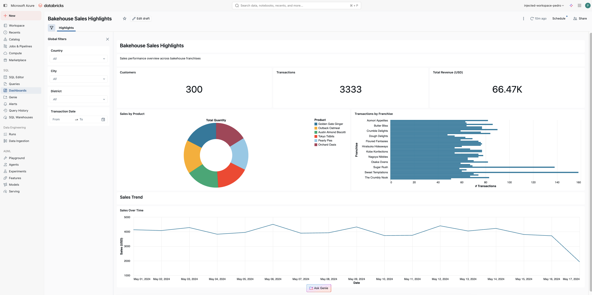

# Power BI to Databricks AI/BI Dashboard Converter

Convert Power BI reports (.pbip) into Databricks AI/BI dashboards (.lvdash.json) using AI-assisted coding with the [Databricks AI Dev Kit](https://github.com/databricks-solutions/ai-dev-kit/tree/main).

This repository provides **two ways** to perform the conversion:

| Method | Best For | How It Works |
|--------|----------|-------------|
| **Databricks App** | Self-service, non-technical users | Upload a zip, click a button, get a published dashboard |
| **Local IDE** | Developers who want full control | AI coding assistant parses `.pbip` files and builds the dashboard interactively |

---

## Before & After

**Power BI Desktop**


**Databricks AI/BI Dashboard**



---

## Method 1: Databricks App (Self-Service)

The `app_for_conversions/` folder contains a ready-to-deploy Streamlit app that runs on Databricks Apps. It provides a simple web UI where users upload a zipped `.pbip` project, and the app uses an LLM to convert it into a published AI/BI dashboard -- no IDE or coding required.

### Architecture

```
┌──────────────────────┐       ┌──────────────────────────┐       ┌──────────────────────┐
│  User's Browser      │       │  Databricks App          │       │  Databricks Workspace│
│                      │       │  (Streamlit on port 8080)│       │                      │
│  Upload .pbip zip ───┼──────>│                          │       │                      │
│  Enter report name   │       │  1. Extract zip          │       │                      │
│  Click "Convert"     │       │  2. Parse PBI structure  │       │                      │
│                      │       │  3. Send to LLM endpoint │──────>│  Model Serving       │
│                      │       │  4. Parse JSON response  │       │  (Claude Opus 4.6)   │
│  ← Open Dashboard ───┼──────<│  5. Create dashboard     │──────>│  Lakeview API        │
│                      │       │  6. Publish dashboard    │──────>│  SQL Warehouse       │
└──────────────────────┘       └──────────────────────────┘       └──────────────────────┘
```

### Prerequisites

- A Databricks workspace with:
  - A **SQL warehouse** (the warehouse ID is configured in `app.yaml`)
  - A **Model Serving endpoint** for the LLM (default: `databricks-claude-opus-4-6`)
  - **Databricks Apps** enabled

### Deploy the App

1. **Configure `app.yaml`**

   Update the warehouse ID and LLM model to match your workspace:

   ```yaml
   command: ["streamlit", "run", "app.py"]

   env:
     - name: DATABRICKS_WAREHOUSE_ID
       value: "<your-warehouse-id>"
     - name: LLM_MODEL
       value: "databricks-claude-opus-4-6"
   ```

   To find your warehouse ID, run:
   ```bash
   databricks warehouses list --output json | jq '.[].id'
   ```

2. **Grant the app's service principal access to the SQL warehouse**

   When you create a Databricks App, a service principal is automatically provisioned for it. This service principal needs **CAN USE** permission on the SQL warehouse configured in `app.yaml`, because the app uses the service principal's credentials (not the user's token) to create dashboards, publish them, validate SQL queries, and create workspace folders.

   To grant access:
   1. Go to **SQL Warehouses** in the Databricks UI
   2. Click on your warehouse > **Permissions**
   3. Add the app's service principal (named after your app, e.g., `pbi-converter`) with **Can use** permission

   Without this, the app will fail with permission errors when trying to deploy or validate dashboards.

3. **Upload and deploy**

   ```bash
   # Upload app files to your workspace
   databricks workspace import-dir \
     app_for_conversions \
     /Workspace/Users/<your-email>/apps/pbi-converter \
     --overwrite

   # Create the app (first time only)
   databricks apps create pbi-converter \
     --description "Power BI to AI/BI Converter"

   # Deploy
   databricks apps deploy pbi-converter \
     --source-code-path /Workspace/Users/<your-email>/apps/pbi-converter
   ```

3. **Open the app** at the URL shown in the deploy output (e.g., `https://pbi-converter-<workspace>.azure.databricksapps.com`).

### Using the App

1. **Export from Power BI Desktop**: File > Save As > Power BI project files (*.pbip)
2. **Zip the results**: Select the `.pbip` file, `.Report/` folder, and `.SemanticModel/` folder, then compress them into a single `.zip` file
3. **Upload**: Open the app, enter a dashboard name, upload the zip, and click **Convert & Publish**
4. **View**: Click the **Open Dashboard** link to see your new AI/BI dashboard

### App File Structure

```
app_for_conversions/
├── app.py              # Streamlit app: UI + conversion logic
├── app.yaml            # Databricks Apps config (command, env vars)
├── requirements.txt    # Python dependencies (databricks-sdk, openai)
├── knowledge/          # Reference docs loaded into the LLM system prompt
│   ├── CONVERSION_GUIDE.md
│   └── AIBI_DASHBOARD_SKILL.md
└── static/
    └── power_bi_save_as_pbip.png
```

---

## Method 2: Local IDE (Developer Workflow)

Use an AI coding assistant (Cursor, Claude Code, Windsurf) with the Databricks AI Dev Kit's MCP tools to convert dashboards interactively. This gives you full control over the output, the ability to test SQL queries before deploying, and iterative refinement.

### Architecture

```
┌───────────────────────┐       ┌───────────────────────────┐       ┌──────────────────────────┐
│   Power BI Desktop    │       │   AI Coding Assistant     │       │   Databricks Workspace   │
│                       │       │   (Cursor / Claude Code)  │       │                          │
│  Save as .pbip ───────┼──────>│                           │       │                          │
│                       │       │  1. Read .pbip structure  │       │                          │
│  Report visuals       │       │  2. Parse semantic model  │       │                          │
│  Semantic model       │       │  3. Map visuals to widgets│       │                          │
│  Relationships        │       │  4. Generate SQL datasets │──────>│  Test queries via SQL    │
│                       │       │  5. Build .lvdash.json    │       │  warehouse               │
│                       │       │  6. Deploy dashboard      │──────>│  Publish AI/BI dashboard │
└───────────────────────┘       └───────────────────────────┘       └──────────────────────────┘
```

### Prerequisites

- **Power BI Desktop** (to export your report as `.pbip`)
- **Databricks workspace** with a SQL warehouse and Unity Catalog tables
- **AI coding assistant** with MCP support: [Cursor](https://cursor.com), [Claude Code](https://docs.anthropic.com/en/docs/agents-and-tools/claude-code/overview), or [Windsurf](https://windsurf.com)
- **Python 3.11+** (for the AI Dev Kit MCP server)

### Quick Start

#### 1. Install the Databricks AI Dev Kit

```bash
# macOS / Linux
curl -fsSL https://raw.githubusercontent.com/databricks-solutions/ai-dev-kit/main/install.sh | bash
```

```powershell
# Windows (PowerShell)
irm https://raw.githubusercontent.com/databricks-solutions/ai-dev-kit/main/install.ps1 | iex
```

This sets up the Databricks MCP server and installs skills for dashboard development.

#### 2. Set Up Your Conversion Project

```
my-pbi-converter/
├── .cursor/
│   ├── mcp.json                    # AI Dev Kit MCP config (auto-created)
│   └── skills/                     # AI Dev Kit skills (auto-created)
├── pbi-to-aibi-converter/
│   ├── input/                      # Place your .pbip reports here
│   │   └── YourReport.pbip
│   │   └── YourReport.Report/
│   │   └── YourReport.SemanticModel/
│   ├── output/                     # Converted .lvdash.json files
│   └── CONVERSION_GUIDE.md         # Conversion rules for the AI assistant
└── README.md
```

```bash
mkdir -p pbi-to-aibi-converter/input pbi-to-aibi-converter/output
```

Copy `CONVERSION_GUIDE.md` from this repository into your project.

#### 3. Export Your Power BI Report

1. Open the report in Power BI Desktop
2. Go to **File > Save As**
3. Select **Power BI project files (\*.pbip)** from the "Save as type" dropdown
4. Save to your `pbi-to-aibi-converter/input/` folder

> **Note:** The `.pbip` format is Power BI's source-control-friendly project format. Unlike `.pbix` (binary), `.pbip` files can be read and understood by AI coding assistants. See the [Power BI Projects documentation](https://learn.microsoft.com/en-us/power-bi/developer/projects/projects-overview) for details.

#### 4. Ask Your AI Assistant to Convert

Example prompts:

> Convert the Power BI dashboard from `pbi-to-aibi-converter/input/` to a Databricks AI/BI dashboard. Follow the conversion instructions in `pbi-to-aibi-converter/CONVERSION_GUIDE.md`. Save the output as a `.lvdash.json` file in `pbi-to-aibi-converter/output/`.

> Read the .pbip report in `pbi-to-aibi-converter/input/MyReport.Report/` and its semantic model in `pbi-to-aibi-converter/input/MyReport.SemanticModel/`. Map every visual to the equivalent AI/BI widget using CONVERSION_GUIDE.md. Test all SQL queries against my warehouse before creating the .lvdash.json.

The assistant will:
1. Parse `.tmdl` table files to find source tables (`catalog.schema.table`)
2. Read `relationships.tmdl` to understand JOINs
3. Read each `visual.json` to identify chart types, measures, and dimensions
4. Design SQL datasets that flatten the PBI star schema
5. Test every query via the `execute_sql` MCP tool
6. Build the `.lvdash.json` following AI/BI dashboard spec rules
7. Deploy and publish the dashboard to your workspace

#### 5. Publish the Dashboard

**Option A: Let the assistant deploy (recommended)**

> Deploy the .lvdash.json file from `pbi-to-aibi-converter/output/` to my workspace and publish it.

**Option B: Databricks CLI**

```bash
databricks workspace import \
  pbi-to-aibi-converter/output/YourDashboard.lvdash.json \
  /Workspace/Users/your-email@company.com/YourDashboard.lvdash.json \
  --format AUTO --overwrite
```

**Option C: Databricks Asset Bundles (CI/CD)**

```yaml
# databricks.yml
resources:
  dashboards:
    my_dashboard:
      display_name: "My Converted Dashboard"
      file_path: ../pbi-to-aibi-converter/output/YourDashboard.lvdash.json
      warehouse_id: ${var.warehouse_id}
```

```bash
databricks bundle deploy
```

---

## Included Example

| File | Description |
|------|-------------|
| `pbi-to-aibi-converter/input/BakehouseReport.pbip` | Original Power BI report (Bakehouse franchise sales) |
| `pbi-to-aibi-converter/input/BakehouseReport.Report/` | PBI report definition (visuals, pages, themes) |
| `pbi-to-aibi-converter/input/BakehouseReport.SemanticModel/` | PBI semantic model (tables, relationships, columns) |
| `pbi-to-aibi-converter/output/BakehouseSalesHighlights.lvdash.json` | Converted AI/BI dashboard |
| `pbi-to-aibi-converter/CONVERSION_GUIDE.md` | Detailed conversion instructions |

The example converts a Bakehouse Sales dashboard with:
- 2 KPI cards (Customers, Transactions) + 1 added (Revenue)
- 1 donut chart (Sales by Product) -> pie chart
- 1 pivot table (Transactions by Franchise) -> bar chart
- 1 line chart (Sales Over Time)
- 4 slicers (Country, City, District, Date) -> global filters

Data source: `samples.bakehouse` (available on all Databricks workspaces).

---

## Conversion Guide Summary

The full guide is in [`pbi-to-aibi-converter/CONVERSION_GUIDE.md`](pbi-to-aibi-converter/CONVERSION_GUIDE.md). Key mappings:

### Visual Type Mapping

| Power BI Visual | AI/BI Widget | Version |
|-----------------|-------------|---------|
| `textbox` | Text (multilineTextboxSpec) | N/A |
| `card` | `counter` | 2 |
| `slicer` (dropdown) | `filter-multi-select` | 2 |
| `slicer` (date range) | `filter-date-range-picker` | 2 |
| `lineChart` | `line` | 3 |
| `barChart` | `bar` | 3 |
| `donutChart` / `pieChart` | `pie` | 3 |
| `pivotTable` / `table` | `table` | 2 |
| `shape` | (skip -- decorative) | - |

### Aggregation Mapping

| PBI DAX Function | SQL Equivalent |
|------------------|---------------|
| SUM(column) | `SUM(\`column\`)` |
| AVERAGE(column) | `AVG(\`column\`)` |
| COUNT(column) | `COUNT(\`column\`)` |
| DISTINCTCOUNT(column) | `COUNT(DISTINCT \`column\`)` |
| MIN(column) / MAX(column) | `MIN(\`column\`)` / `MAX(\`column\`)` |

### Key Differences

| Concept | Power BI | Databricks AI/BI |
|---------|----------|------------------|
| Data model | Star schema with relationships | Flat SQL datasets with JOINs |
| Measures | DAX expressions | SQL aggregations in widget fields |
| Filters | Slicers on canvas | Filter widgets on global or page-level filter pages |
| Layout | Pixel coordinates (1280x720) | 6-column grid system |
| Deployment | Publish to Power BI Service | Deploy `.lvdash.json` to workspace |

---

## Tips for Complex Dashboards

- **Multi-page reports**: Each PBI page becomes a separate `PAGE_TYPE_CANVAS` page. Pages are listed in `pages/pages.json`.
- **DAX calculated columns**: Move the logic into the SQL dataset query using CASE/WHEN, COALESCE, or other Spark SQL functions.
- **Cross-filtering**: AI/BI filters work through shared dataset columns. Include filter dimensions in every dataset that should respond to that filter.
- **High cardinality dimensions**: If a PBI visual groups by a column with many distinct values (>10), use a table widget instead of a chart, or add a TOP-N filter in the SQL query.
- **Maps / geo visuals**: AI/BI dashboards don't support map widgets. Convert these to tables or bar charts grouped by location.
- **Custom visuals**: No equivalent for PBI custom visuals. Identify the closest standard widget type or represent the data differently.

---

## Relevant Documentation

- [Power BI Projects (.pbip) Overview](https://learn.microsoft.com/en-us/power-bi/developer/projects/projects-overview)
- [How Hard Is It to Migrate a Power BI Dashboard?](https://blog.cauchy.io/p/how-hard-is-it-to-migrate-a-power?r=6r7jvu)
- [Databricks AI Dev Kit](https://github.com/databricks-solutions/ai-dev-kit/tree/main)
- [Databricks AI/BI Dashboards](https://docs.databricks.com/en/dashboards/index.html)
- [Databricks Asset Bundles](https://docs.databricks.com/en/dev-tools/bundles/index.html)

---

## License

This project is provided as-is for educational and demonstration purposes.
